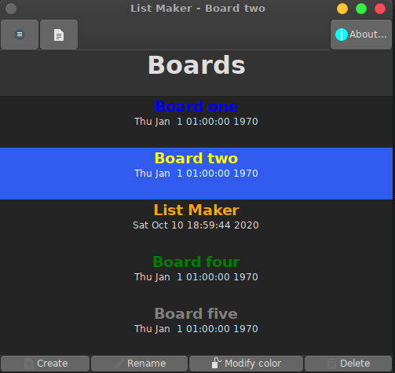
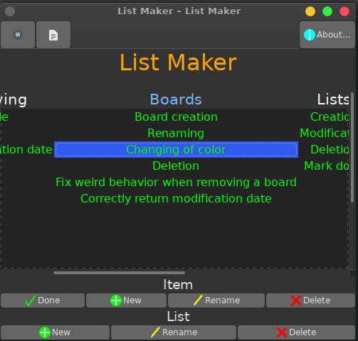
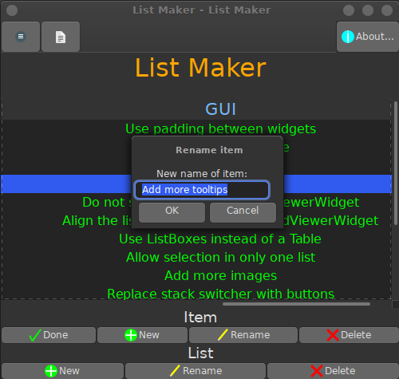
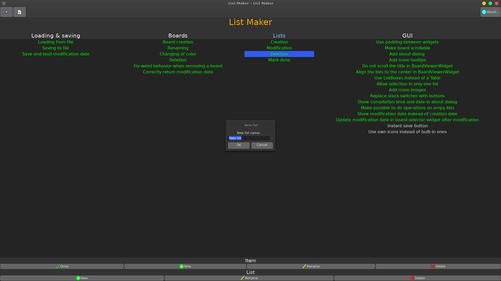

# List Maker

A list maker and to-do manager application with advanced features.

## Compiling

### Requirements
- gcc
- cmake
- make
- gtkmm

Install them on Debian:
~~~
sudo apt install gcc make cmake libgtkmm-3.0-dev
~~~

### Building

Create a build directory
~~~
mkdir build
~~~

Go into it
~~~
cd build
~~~

Generate the Makefile
~~~
cmake ..
~~~

Build
~~~
make
~~~

## File format
[File format](doc/file-format.md)

## Screenshots

## License
List Maker is licensed under the 2-Clause BSD License. See the file: [LICENSE](LICENSE)